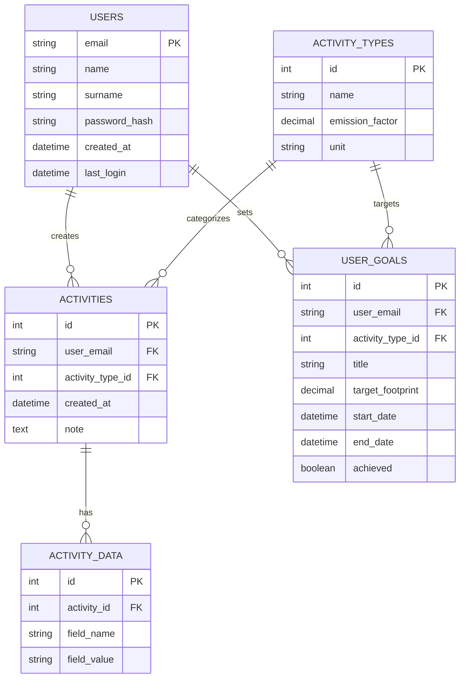
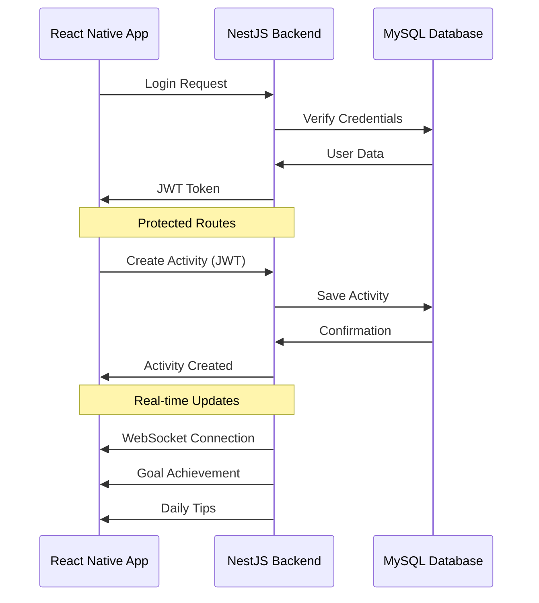

# 🌿 EcoPasso: Cammina Verso un Futuro Sostenibile

**EcoPasso** è l'app che ti aiuta a calcolare, monitorare e ridurre la tua impronta ecologica. Ogni passo conta per rendere il pianeta un posto migliore.  

Con un design intuitivo e strumenti avanzati, EcoPasso ti guida verso uno stile di vita più sostenibile. 🌍✨

---

## 📌 Indice

- [🌍 Cos'è l'Impronta Ecologica](#-cosè-limpronta-ecologica)
- [🎯 Obiettivi del Progetto](#-obiettivi-del-progetto)
- [🌟 Benefici dell'Uso di EcoPasso](#-benefici-delluso-di-ecopasso)
- [🧑‍💻 Tecnologie Utilizzate](#-tecnologie-utilizzate)
- [📱 Interfaccia Utente](#-interfaccia-utente)
- [📊 Schema del Database](#-schema-del-database)
- [⚙️ Esempi di Codice](#️-esempi-di-codice)
- [🚀 Come Avviare EcoPasso](#-come-avviare-ecopasso)
- [📽️ Video Dimostrativo](#️-video-dimostrativo)

---

## 🌍 Cos'è l'Impronta Ecologica

L'**impronta ecologica** è un indicatore globale che misura il consumo umano di risorse naturali rispetto alla capacità del pianeta di rigenerarle.  
Viene calcolata considerando diversi aspetti dell'impatto umano sull'ambiente, tra cui:

- **Emissioni di gas serra (CO2):** Derivanti da trasporti, produzione di energia, riscaldamento e altre attività.
- **Consumo di risorse naturali:** Come acqua, cibo, materiali e combustibili fossili.
- **Produzione di rifiuti:** Inclusi rifiuti non riciclabili e pericolosi.
- **Uso del suolo:** Per agricoltura, urbanizzazione e deforestazione.

### Tipi di Impronta Ecologica

1. **Impronta di carbonio:** Misura le emissioni di CO2 generate da attività quotidiane.
2. **Impronta idrica:** Indica il consumo di acqua dolce.
3. **Impronta dei materiali:** Si riferisce all'uso di risorse come metalli, plastica e legname.
4. **Impronta alimentare:** Analizza l'impatto della produzione e del consumo di cibo.

### Perché è importante monitorare l'impronta ecologica?

- **Prevenire il sovrasfruttamento:** Il pianeta ha risorse limitate e il sovraconsumo porta a conseguenze irreversibili, come cambiamenti climatici e perdita di biodiversità.
- **Aumentare la consapevolezza:** Sapere dove e come possiamo ridurre il nostro impatto è il primo passo verso un cambiamento positivo.
- **Promuovere uno stile di vita sostenibile:** Piccole azioni quotidiane, come ridurre gli sprechi o scegliere fonti di energia rinnovabile, fanno una grande differenza.
- **Garantire un futuro migliore:** Per noi e per le prossime generazioni.

Con **EcoPasso**, monitorare l'impronta ecologica diventa semplice e accessibile a tutti. 🌿

---

## 🎯 Obiettivi del Progetto

**EcoPasso** è stato progettato con una missione chiara: aiutarti a vivere in modo più responsabile e sostenibile. I principali obiettivi includono:

1. **Educazione Ambientale:**
   - Sensibilizzare gli utenti sull'importanza della sostenibilità.
   - Fornire informazioni dettagliate sull'impatto ambientale delle loro azioni.

2. **Monitoraggio e Analisi:**
   - Offrire strumenti per monitorare l'impronta ecologica personale.
   - Visualizzare i progressi con grafici e report chiari e intuitivi.

3. **Promozione di Azioni Concrete:**
   - Suggerire abitudini sostenibili, come ridurre gli sprechi di energia o scegliere mezzi di trasporto ecologici.
   - Premiare i progressi con badge o notifiche motivazionali.

4. **Creazione di una Comunità:**
   - Connettere gli utenti in una rete globale per condividere consigli e ispirazione.
   - Favorire il cambiamento collettivo attraverso la collaborazione.

5. **Supporto alle Politiche Ambientali:**
   - Offrire dati aggregati per supportare iniziative e politiche di sostenibilità.
   - Collaborare con enti locali e globali per promuovere uno sviluppo sostenibile.

---

## 🌟 Benefici dell'Uso di EcoPasso

### Per gli Utenti:

- **Consapevolezza:** Impara a conoscere il tuo impatto ambientale e come ridurlo.
- **Risparmio:** Riduci gli sprechi di energia, acqua e risorse, risparmiando anche denaro.
- **Motivazione:** Raggiungi obiettivi personali e condividi i tuoi successi con la comunità.

### Per il Pianeta:

- **Riduzione delle emissioni:** Promuovendo scelte più ecologiche.
- **Conservazione delle risorse:** Favorendo un uso più responsabile di acqua, energia e materiali.
- **Protezione della biodiversità:** Riducendo l'impatto delle attività umane sull'ambiente naturale.

### Per la Società:

- **Educazione collettiva:** Diffondere conoscenze e buone pratiche.
- **Sviluppo sostenibile:** Supportare comunità e aziende verso un futuro green.
- **Impatto positivo:** Ogni piccolo passo contribuisce a un cambiamento globale.

---

## 🧑‍💻 Tecnologie Utilizzate

### Frontend (Client)

- **Linguaggi:** TypeScript/JavaScript
- **Framework:** [React Native](https://reactnative.dev/) con [Expo](https://expo.dev/)
- **Router:** [Expo Router](https://expo.github.io/router/)
- **Librerie principali:**
  - **@react-navigation**: Per la gestione della navigazione fluida.
  - **React Native Paper**: Per un'interfaccia utente moderna basata su Material Design.
  - **React Native Maps**: Per l'integrazione di mappe interattive e personalizzate.
  - **React Native Chart Kit**: Per la visualizzazione di grafici e dati personalizzati.
  - **React Native Webview**: Per l'integrazione di componenti web.
- **State Management:** Utilizzo di hook e contesto React per la gestione dello stato locale.
- **Tipizzazione:** Utilizzo di **TypeScript** per garantire un codice più robusto e manutenibile.
- **Altri strumenti:**
  - **React Native Gesture Handler**: Per gestire gesture fluide e intuitive.
  - **Async Storage**: Per la memorizzazione locale dei dati utente.
  - **Expo Font e Icons**: Per un design accattivante con font personalizzati e icone.
  - **Expo Linear Gradient**: Per effetti visivi avanzati tramite gradienti.


### Backend (Server - NestJS)

- **Framework:** NestJS v11
- **Language:** TypeScript
- **Core Features:**
  - RESTful API with Express
  - TypeORM for database management
  - JWT + OTP authentication
  - Real-time notifications with WebSocket
  - Email service with Nodemailer
  - API documentation with Swagger
  - Unit and E2E testing with Jest

### Database Schema



### Data Flow Diagram



## 🚀 Getting Started

### Prerequisites
- Node.js 18+
- MySQL 8+
- npm or yarn

### Installation

```bash
# Clone the repository
git clone https://github.com/your-username/ecopasso-backend.git

# Install dependencies
cd ecopasso-backend
npm install

# Configure environment
cp .env.example .env

# Start development server
npm run start:dev
```

### Running Tests

```bash
# Unit tests
npm run test

# E2E tests
npm run test:e2e

# Test coverage
npm run test:cov
```

## 📚 API Documentation

Once the server is running, visit:
- Swagger UI: http://localhost:3000/api
- OpenAPI JSON: http://localhost:3000/api-json

## 📱 Code Examples

### Client-Side (React Native) Examples

#### 1. Authentication Screen
```typescript
// screens/AuthScreen.tsx
import React, { useState } from 'react';
import { View, StyleSheet } from 'react-native';
import { TextInput, Button, Text } from 'react-native-paper';

export const AuthScreen = () => {
  const [email, setEmail] = useState('');
  const [password, setPassword] = useState('');

  const handleLogin = async () => {
    try {
      const response = await fetch('http://localhost:3000/auth/login', {
        method: 'POST',
        headers: { 'Content-Type': 'application/json' },
        body: JSON.stringify({ email, password }),
      });
      const data = await response.json();
      // Store JWT token and navigate to home
    } catch (error) {
      console.error('Login failed:', error);
    }
  };

  return (
    <View style={styles.container}>
      <Text style={styles.title}>EcoPasso</Text>
      <TextInput
        label="Email"
        value={email}
        onChangeText={setEmail}
        mode="outlined"
      />
      <TextInput
        label="Password"
        value={password}
        onChangeText={setPassword}
        secureTextEntry
        mode="outlined"
      />
      <Button mode="contained" onPress={handleLogin}>
        Login
      </Button>
    </View>
  );
};

const styles = StyleSheet.create({
  container: {
    flex: 1,
    padding: 20,
    justifyContent: 'center',
  },
  title: {
    fontSize: 24,
    textAlign: 'center',
    marginBottom: 20,
  },
});
```

#### 2. Activity Creation Component
```typescript
// components/AddActivity.tsx
import React from 'react';
import { View } from 'react-native';
import { TextInput, Button } from 'react-native-paper';
import { useForm, Controller } from 'react-hook-form';

type ActivityForm = {
  activityType: string;
  quantity: string;
  note: string;
};

export const AddActivity = () => {
  const { control, handleSubmit } = useForm<ActivityForm>();

  const onSubmit = async (data: ActivityForm) => {
    try {
      const response = await fetch('http://localhost:3000/activities', {
        method: 'POST',
        headers: {
          'Content-Type': 'application/json',
          'Authorization': `Bearer ${/* JWT Token */}`,
        },
        body: JSON.stringify(data),
      });
      // Handle success
    } catch (error) {
      console.error('Failed to add activity:', error);
    }
  };

  return (
    <View>
      <Controller
        control={control}
        name="activityType"
        rules={{ required: true }}
        render={({ field: { onChange, value } }) => (
          <TextInput
            label="Tipo di attività"
            onChangeText={onChange}
            value={value}
          />
        )}
      />
      {/* Other form fields */}
      <Button onPress={handleSubmit(onSubmit)}>
        Aggiungi Attività
      </Button>
    </View>
  );
};
```

#### 3. Progress Chart Component
```typescript
// components/FootprintChart.tsx
import React from 'react';
import { Dimensions } from 'react-native';
import { LineChart } from 'react-native-chart-kit';

export const FootprintChart = ({ data }) => {
  return (
    <LineChart
      data={{
        labels: ['Gen', 'Feb', 'Mar', 'Apr', 'Mag', 'Giu'],
        datasets: [{
          data: data.map(d => d.footprint)
        }]
      }}
      width={Dimensions.get('window').width - 40}
      height={220}
      chartConfig={{
        backgroundColor: '#ffffff',
        backgroundGradientFrom: '#ffffff',
        backgroundGradientTo: '#ffffff',
        decimalPlaces: 2,
        color: (opacity = 1) => `rgba(46, 125, 50, ${opacity})`,
        style: {
          borderRadius: 16,
        },
      }}
      style={{
        marginVertical: 8,
        borderRadius: 16,
      }}
    />
  );
};
```

#### 4. Custom Navigation Hook
```typescript
// hooks/useNavigation.ts
import { useNavigation as useNativeNavigation } from '@react-navigation/native';

export const useNavigation = () => {
  const navigation = useNativeNavigation();

  const navigateToActivity = (activityId: string) => {
    navigation.navigate('ActivityDetail', { activityId });
  };

  const navigateToGoals = () => {
    navigation.navigate('Goals');
  };

  const navigateToProfile = () => {
    navigation.navigate('Profile');
  };

  return {
    navigateToActivity,
    navigateToGoals,
    navigateToProfile,
  };
};
```

Questi esempi mostrano:
- Schermata di autenticazione con gestione del modulo
- Creazione di attività con validazione del modulo
- Visualizzazione dei dati con grafici
- Hook di navigazione personalizzato
- Integrazione con l'API di backend NestJS
