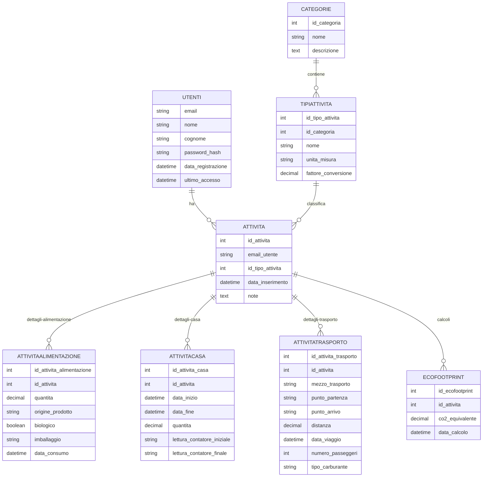
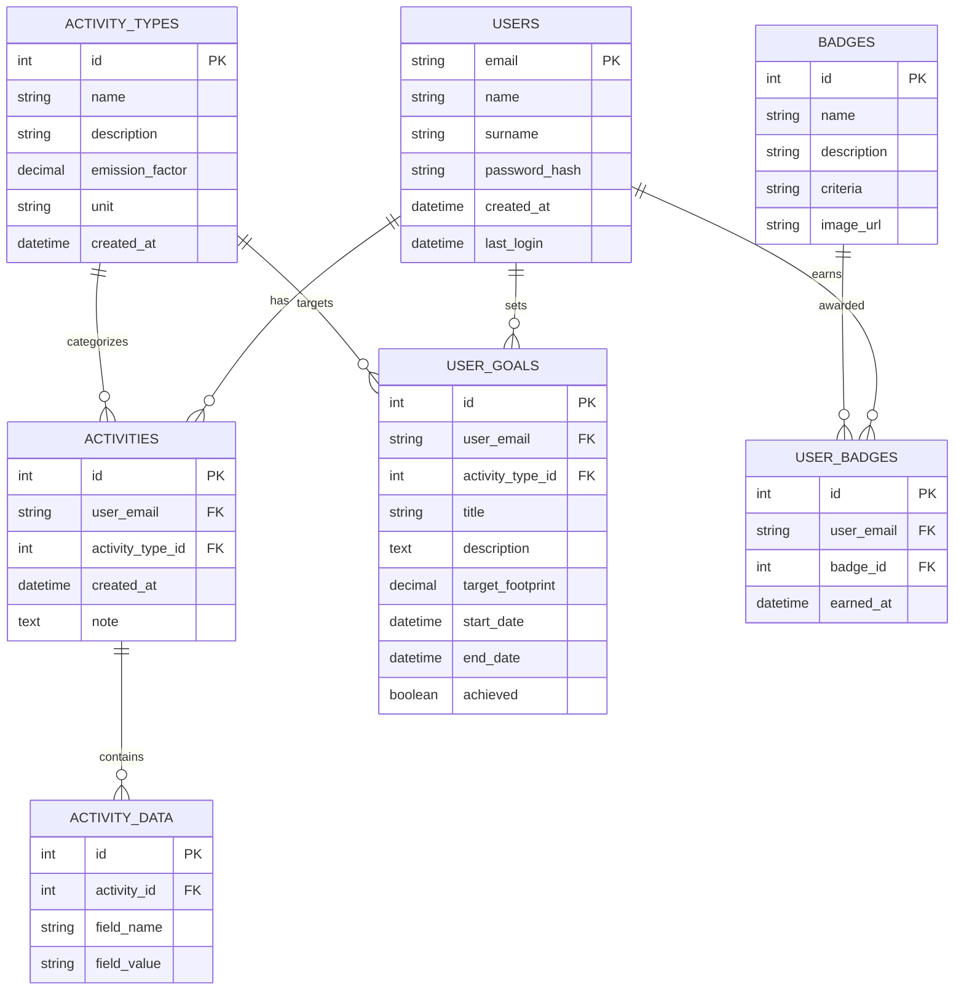

# 🌿 EcoPasso: Cammina Verso un Futuro Sostenibile

**EcoPasso** è l'app che ti aiuta a calcolare, monitorare e ridurre la tua impronta ecologica. Ogni passo conta per rendere il pianeta un posto migliore.  

Con un design intuitivo e strumenti avanzati, EcoPasso ti guida verso uno stile di vita più sostenibile. 🌍✨

---

## 📌 Indice

- [🌍 Cos'è l'Impronta Ecologica](#-cosè-limpronta-ecologica)
- [🎯 Obiettivi del Progetto](#-obiettivi-del-progetto)
- [🌟 Benefici dell'Uso di EcoPasso](#-benefici-delluso-di-ecopasso)
- [🧑‍💻 Tecnologie Utilizzate](#-tecnologie-utilizzate)
- [📱 Interfaccia Utente](#-interfaccia-utente)
- [📊 Schema del Database](#-schema-del-database)
- [⚙️ Esempi di Codice](#️-esempi-di-codice)
- [🚀 Come Avviare EcoPasso](#-come-avviare-ecopasso)
- [📽️ Video Dimostrativo](#️-video-dimostrativo)

---

## 🌍 Cos'è l'Impronta Ecologica

L'**impronta ecologica** è un indicatore globale che misura il consumo umano di risorse naturali rispetto alla capacità del pianeta di rigenerarle.  
Viene calcolata considerando diversi aspetti dell'impatto umano sull'ambiente, tra cui:

- **Emissioni di gas serra (CO2):** Derivanti da trasporti, produzione di energia, riscaldamento e altre attività.
- **Consumo di risorse naturali:** Come acqua, cibo, materiali e combustibili fossili.
- **Produzione di rifiuti:** Inclusi rifiuti non riciclabili e pericolosi.
- **Uso del suolo:** Per agricoltura, urbanizzazione e deforestazione.

### Tipi di Impronta Ecologica

1. **Impronta di carbonio:** Misura le emissioni di CO2 generate da attività quotidiane.
2. **Impronta idrica:** Indica il consumo di acqua dolce.
3. **Impronta dei materiali:** Si riferisce all'uso di risorse come metalli, plastica e legname.
4. **Impronta alimentare:** Analizza l'impatto della produzione e del consumo di cibo.

### Perché è importante monitorare l'impronta ecologica?

- **Prevenire il sovrasfruttamento:** Il pianeta ha risorse limitate e il sovraconsumo porta a conseguenze irreversibili, come cambiamenti climatici e perdita di biodiversità.
- **Aumentare la consapevolezza:** Sapere dove e come possiamo ridurre il nostro impatto è il primo passo verso un cambiamento positivo.
- **Promuovere uno stile di vita sostenibile:** Piccole azioni quotidiane, come ridurre gli sprechi o scegliere fonti di energia rinnovabile, fanno una grande differenza.
- **Garantire un futuro migliore:** Per noi e per le prossime generazioni.

Con **EcoPasso**, monitorare l'impronta ecologica diventa semplice e accessibile a tutti. 🌿

---

## 🎯 Obiettivi del Progetto

**EcoPasso** è stato progettato con una missione chiara: aiutarti a vivere in modo più responsabile e sostenibile. I principali obiettivi includono:

1. **Educazione Ambientale:**
   - Sensibilizzare gli utenti sull'importanza della sostenibilità.
   - Fornire informazioni dettagliate sull'impatto ambientale delle loro azioni.

2. **Monitoraggio e Analisi:**
   - Offrire strumenti per monitorare l'impronta ecologica personale.
   - Visualizzare i progressi con grafici e report chiari e intuitivi.

3. **Promozione di Azioni Concrete:**
   - Suggerire abitudini sostenibili, come ridurre gli sprechi di energia o scegliere mezzi di trasporto ecologici.
   - Premiare i progressi con badge o notifiche motivazionali.

4. **Creazione di una Comunità:**
   - Connettere gli utenti in una rete globale per condividere consigli e ispirazione.
   - Favorire il cambiamento collettivo attraverso la collaborazione.

5. **Supporto alle Politiche Ambientali:**
   - Offrire dati aggregati per supportare iniziative e politiche di sostenibilità.
   - Collaborare con enti locali e globali per promuovere uno sviluppo sostenibile.

---

## 🌟 Benefici dell'Uso di EcoPasso

### Per gli Utenti:

- **Consapevolezza:** Impara a conoscere il tuo impatto ambientale e come ridurlo.
- **Risparmio:** Riduci gli sprechi di energia, acqua e risorse, risparmiando anche denaro.
- **Motivazione:** Raggiungi obiettivi personali e condividi i tuoi successi con la comunità.

### Per il Pianeta:

- **Riduzione delle emissioni:** Promuovendo scelte più ecologiche.
- **Conservazione delle risorse:** Favorendo un uso più responsabile di acqua, energia e materiali.
- **Protezione della biodiversità:** Riducendo l'impatto delle attività umane sull'ambiente naturale.

### Per la Società:

- **Educazione collettiva:** Diffondere conoscenze e buone pratiche.
- **Sviluppo sostenibile:** Supportare comunità e aziende verso un futuro green.
- **Impatto positivo:** Ogni piccolo passo contribuisce a un cambiamento globale.

---

## 🧑‍💻 Tecnologie Utilizzate

### Frontend (Client)

- **Linguaggi:** TypeScript/JavaScript
- **Framework:** [React Native](https://reactnative.dev/) con [Expo](https://expo.dev/)
- **Router:** [Expo Router](https://expo.github.io/router/)
- **Librerie principali:**
  - **@react-navigation**: Per la gestione della navigazione fluida.
  - **React Native Paper**: Per un'interfaccia utente moderna basata su Material Design.
  - **React Native Maps**: Per l'integrazione di mappe interattive e personalizzate.
  - **React Native Chart Kit**: Per la visualizzazione di grafici e dati personalizzati.
  - **React Native Webview**: Per l'integrazione di componenti web.
- **State Management:** Utilizzo di hook e contesto React per la gestione dello stato locale.
- **Tipizzazione:** Utilizzo di **TypeScript** per garantire un codice più robusto e manutenibile.
- **Altri strumenti:**
  - **React Native Gesture Handler**: Per gestire gesture fluide e intuitive.
  - **Async Storage**: Per la memorizzazione locale dei dati utente.
  - **Expo Font e Icons**: Per un design accattivante con font personalizzati e icone.
  - **Expo Linear Gradient**: Per effetti visivi avanzati tramite gradienti.


### Backend (Server)

- **Linguaggio:** Java
- **Framework:** [Spring Boot](https://spring.io/projects/spring-boot)
- **Funzionalità principali:**
  - API RESTful per una comunicazione veloce e sicura.
  - Gestione avanzata dell'autenticazione e autorizzazione utilizzando JWT.
  - Calcolo dinamico dell'impronta ecologica basato sui dati forniti dagli utenti.
  - Logging e monitoraggio con strumenti integrati per garantire la stabilità del sistema.

### Esempi di codice

#### Configurazione di un Controller REST

```java
@RestController
@RequestMapping("/api/footprint")
public class FootprintController {

    private final FootprintService footprintService;

    public FootprintController(FootprintService footprintService) {
        this.footprintService = footprintService;
    }

    @GetMapping("/{userId}")
    public ResponseEntity<Footprint> getUserFootprint(@PathVariable Long userId) {
        Footprint footprint = footprintService.calculateFootprint(userId);
        return ResponseEntity.ok(footprint);
    }
}
```

#### Configurazione di Sicurezza con JWT

```java
@EnableWebSecurity
public class SecurityConfig extends WebSecurityConfigurerAdapter {

    @Override
    protected void configure(HttpSecurity http) throws Exception {
        http.csrf().disable()
            .authorizeRequests()
            .antMatchers("/api/auth/**").permitAll()
            .anyRequest().authenticated()
            .and()
            .addFilter(new JwtAuthenticationFilter(authenticationManager()))
            .addFilter(new JwtAuthorizationFilter(authenticationManager()));
    }
}
```
---

### Database

- **Sistema:** [MySQL](https://www.mysql.com/)
- **Struttura:**
  - Tabelle ben organizzate per utenti, attività e calcoli ambientali.

---

## 📱 Interfaccia Utente


*Benvenuto nella tua dashboard personalizzata.*


*Inserisci i tuoi dati per calcolare l'impatto.*


*Visualizza i tuoi progressi e ricevi consigli utili.*

---

## 📊 Schema del Database

Ecco uno schema visivo del database che alimenta **EcoPasso**:



---

## ⚙️ Esempi di Codice

### Frontend (React Native con TypeScript)

```typescript
import { NavigationContainer } from '@react-navigation/native';
import { createBottomTabNavigator } from '@react-navigation/bottom-tabs';
import HomeScreen from './screens/HomeScreen';
import ProfileScreen from './screens/ProfileScreen';

const Tab = createBottomTabNavigator();

export default function App(): JSX.Element {
  return (
    <NavigationContainer>
      <Tab.Navigator>
        <Tab.Screen name="Home" component={HomeScreen} />
        <Tab.Screen name="Profile" component={ProfileScreen} />
      </Tab.Navigator>
    </NavigationContainer>
  );
}
```

---

## 🚀 Come Avviare EcoPasso

### Prerequisiti

- [Node.js](https://nodejs.org/) installato.
- [Expo CLI](https://docs.expo.dev/get-started/installation/) installato globalmente.
- [Java JDK](https://www.oracle.com/java/technologies/javase-downloads.html) installato.
- [MySQL](https://www.mysql.com/) installato e configurato.

### Avvio del Client

```bash
cd client
npm install
npx expo start
```

### Avvio del Server

```bash
cd server
./mvnw spring-boot:run
```

---

## 📽️ Video Dimostrativo

Scopri come funziona **EcoPasso** con il nostro video dimostrativo:

[](https://www.youtube.com/watch?v=tuo_video_id)

---

# 🌿 EcoPasso Backend (NestJS)

## 📑 Table of Contents
- [Overview](#overview)
- [Tech Stack](#tech-stack)
- [Database Schema](#database-schema)
- [API Documentation](#api-documentation)
- [Code Examples](#code-examples)
- [Installation & Setup](#installation--setup)
- [Testing](#testing)

## Overview
EcoPasso backend handles ecological footprint calculation, user activities tracking, and environmental goals management.

## Tech Stack
- **Framework:** NestJS v11
- **Language:** TypeScript
- **Database:** MySQL
- **ORM:** TypeORM
- **Authentication:** JWT + OTP
- **Email:** Nodemailer
- **Documentation:** Swagger
- **Testing:** Jest

## Database Schema



## Code Examples

### 1. Authentication

```typescript
// filepath: src/auth/auth.controller.ts
@Controller('auth')
@ApiTags('Authentication')
export class AuthController {
  @Post('register')
  @ApiOperation({ summary: 'Register new user' })
  async register(@Body() createUserDto: CreateUserDto) {
    return this.authService.register(createUserDto);
  }

  @Post('login')
  @ApiOperation({ summary: 'User login' })
  async login(@Body() loginDto: LoginDto) {
    return this.authService.login(loginDto);
  }

  @Post('forgot-password')
  @ApiOperation({ summary: 'Request password reset' })
  async forgotPassword(@Body() body: { email: string }) {
    return this.authService.sendPasswordReset(body.email);
  }
}
```

### 2. Activities Tracking

```typescript
// filepath: src/activities/activities.service.ts
@Injectable()
export class ActivitiesService {
  async create(createActivityDto: CreateActivityDto) {
    const activity = this.activityRepo.create({
      user: { email: createActivityDto.userEmail },
      activityType: { id: createActivityDto.activityTypeId },
      note: createActivityDto.note,
      created_at: new Date()
    });

    const saved = await this.activityRepo.save(activity);

    // Save activity data
    for (const data of createActivityDto.data) {
      await this.activityDataRepo.save({
        activity: { id: saved.id },
        field_name: data.field_name,
        field_value: data.field_value
      });
    }

    return saved;
  }

  async calculateFootprint(activityId: number): Promise<number> {
    const activity = await this.activityRepo.findOne({
      where: { id: activityId },
      relations: ['activityType', 'data']
    });

    const emissionFactor = Number(activity.activityType.emission_factor);
    let quantity = 1;

    const quantityData = activity.data.find(d => 
      ['quantity', 'distance_km', 'consumption'].includes(d.field_name)
    );

    if (quantityData) {
      quantity = Number(quantityData.field_value);
    }

    return emissionFactor * quantity;
  }
}
```

### 3. Goals Management

```typescript
// filepath: src/goals/goals.service.ts
@Injectable()
export class GoalsService {
  async createGoal(createGoalDto: CreateGoalDto) {
    const goal = this.goalRepo.create({
      title: createGoalDto.title,
      description: createGoalDto.description,
      target_footprint: createGoalDto.target_footprint,
      start_date: new Date(),
      end_date: createGoalDto.end_date,
      user: { email: createGoalDto.userEmail },
      activityType: { id: createGoalDto.activityTypeId },
      achieved: false
    });

    return this.goalRepo.save(goal);
  }

  async getProgress(email: string) {
    const goals = await this.goalRepo.find({
      where: { user: { email } },
      relations: ['activityType', 'user']
    });

    return Promise.all(goals.map(async goal => {
      const activities = await this.activitiesService.findByUserAndType(
        email,
        goal.activityType.id,
        goal.start_date,
        goal.end_date
      );

      const totalFootprint = activities.reduce((sum, activity) => 
        sum + activity.footprint, 0
      );

      return {
        id: goal.id,
        title: goal.title,
        progress: Math.min(1, totalFootprint / goal.target_footprint),
        currentFootprint: totalFootprint,
        targetFootprint: goal.target_footprint,
        achieved: totalFootprint >= goal.target_footprint,
        daysLeft: Math.max(0, differenceInDays(goal.end_date, new Date()))
      };
    }));
  }
}
```

## Installation & Setup

```bash
# Install dependencies
npm install

# Configure environment
cp .env.example .env

# Run database migrations
npm run typeorm:run-migrations

# Start development server
npm run start:dev

# Build for production
npm run build
npm run start:prod
```

## Testing

```bash
# Unit tests
npm run test

# Integration tests
npm run test:e2e

# Test coverage
npm run test:cov
```

## API Documentation

After starting the server, visit:
- Swagger UI: `http://localhost:3000/api`
- OpenAPI JSON: `http://localhost:3000/api-json`
